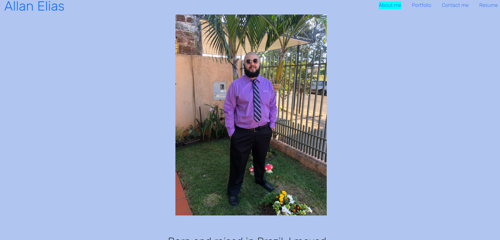
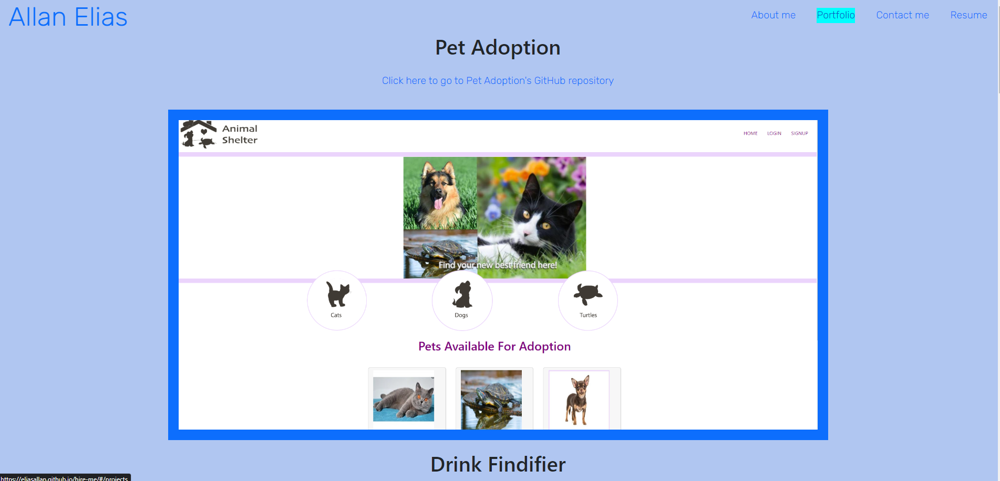
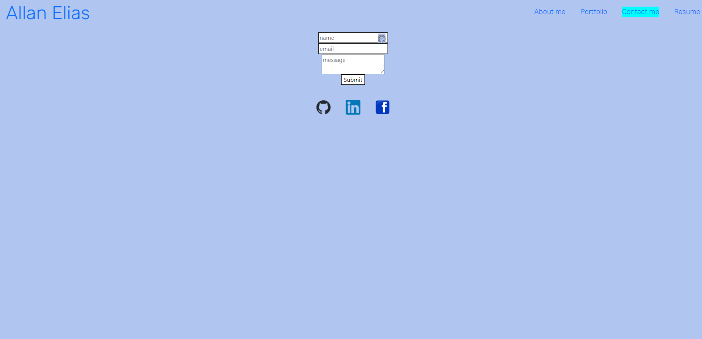
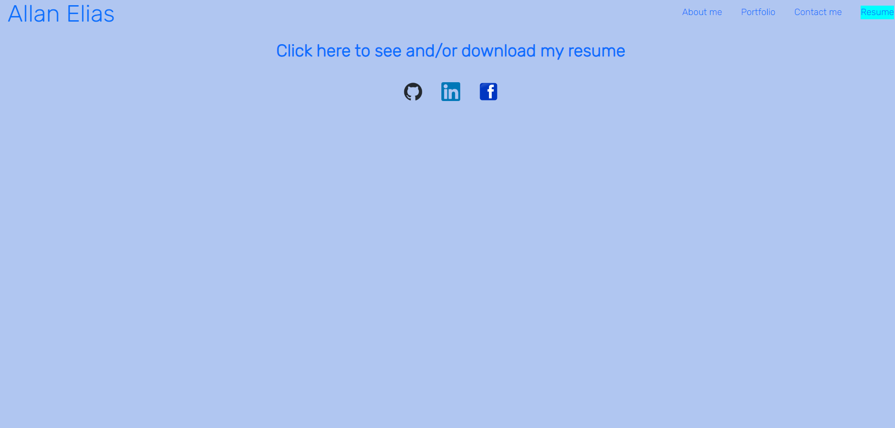

https://opensource.org/licenses/MIT

# Hire Me

## Description 
This is a portfolio made using React. It shows the features React has to offer, like conditionally rendered pages and component mangement.

## Installation  
run npm i then use npm run start to start the server

## Technologies  
React, Javascript, Node

## Usage  
Go to the contact me page to send me a message or to the Resume page to download my resume

## Contributing 
Email me to talk about collaborating

## Tests
No tests were designed for this project

## License
This application is covered by the MIT license

## Questions
https://github.com/EliasAllan

or

E-mail me at: allanrnelias@gmail.com

## Application Screenshot

## Table of contents
- [Description](#description)
- [Installation](#installation)
- [Usage](#usage)
- [Contributing](#contributing)
- [Tests](#tests)
- [License](#license)
- [Questions](#questions)

## Link to deployed application

https://eliasallan.github.io/hire-me/